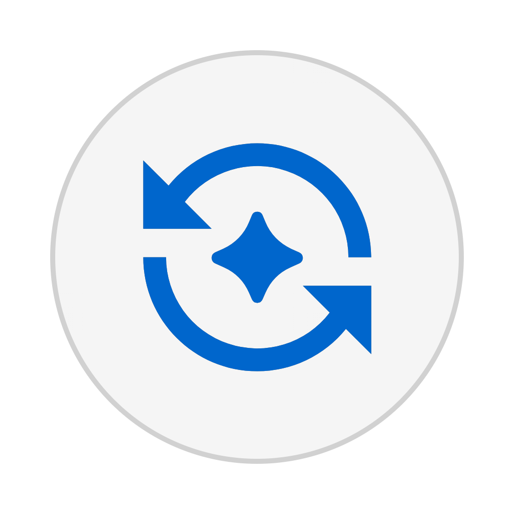
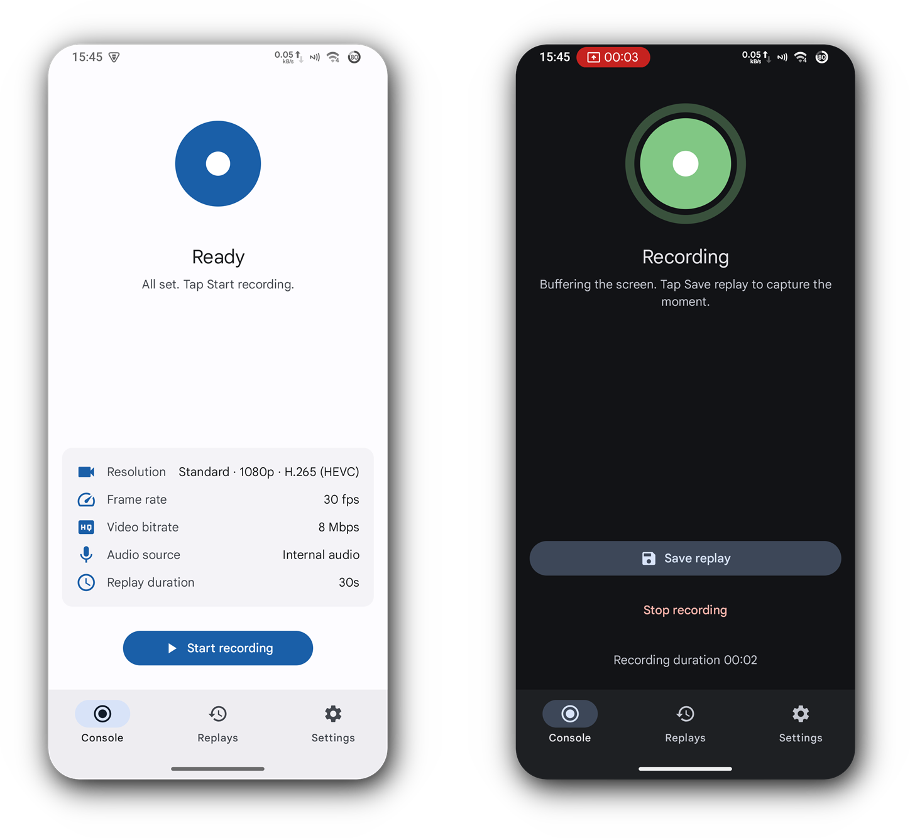

  
  <h1>Highlight Replay</h1>

A replay-style screen recorder: the screen is recorded to memory continuously, and the last few seconds can be saved as a video on demand.

English | [简体中文](README_ZH_CN.md) | [繁體中文](README_ZH_TW.md)

  

## 🚀 Download

🔗 [Download from GitHub Releases](https://github.com/Pia300/highlight-replay/releases)

## ✨ Features

- Replay recording: tap "Save replay" to save the last few seconds as a video, without starting a recording in advance
- Nothing is written to disk while recording; a file is produced only by a save action, and the same content can be saved repeatedly
- Configurable recording: resolution 720p / 1080p / 1440p / custom, frame rate 24 / 30 / 60 fps, bitrate 4 / 8 / 12 / 16 Mbps, replay length 30 / 60 seconds
- Internal audio: record device audio (Android 10 and above), or record without sound
- Selectable encoders: H.264 or H.265, hardware / software / automatic
- Rotation adaptive: content is rotated to match the capture direction, or force portrait / landscape
- Floating ball: floating quick controls for the recording session, with adjustable size, opacity and position
- Quick Settings tiles: start recording / save replay / toggle floating ball
- Notification controls: save or stop from the notification while recording, with video and audio status shown
- Replay library: search, sort, rename, share, play, bulk delete
- Tags: custom tags with colours, batch tagging
- Material 3 UI, with dark mode and wallpaper-based colour (Android 12 and above)
- 11 UI languages: 简体中文, 繁體中文, English, 日本語, 한국어, Español, Português, Bahasa Indonesia, Tiếng Việt, ไทย, Русский
- Separate status indicators for the video stream and the audio input

## 📖 Getting started

1. Open the app, tap "Start recording" and allow screen recording in the system dialog
2. Use the device as usual; the screen is recorded to memory continuously
3. When you want to keep something, tap "Save replay" — the last 30 seconds are saved to the gallery

> [!TIP]
> If the device gets hot, stutters, or the app crashes, lower the resolution and frame rate.

## ✨ Technology stack

This project is developed using [Android Studio](https://developer.android.com/studio).

| Technology | Role |
|:--|:--|
| [Kotlin](https://kotlinlang.org/) | Development language |
| [Jetpack Compose](https://developer.android.com/jetpack/compose) | UI framework |
| [Material 3](https://m3.material.io/) | UI design |
| [Coroutines](https://github.com/Kotlin/kotlinx.coroutines) | Async and state streams |
| [MediaCodec](https://developer.android.com/reference/android/media/MediaCodec) / [MediaMuxer](https://developer.android.com/reference/android/media/MediaMuxer) | Encoding and muxing |

## 📊 Community

📖 [DeepWiki](https://deepwiki.com/Pia300/highlight-replay) · AI-generated wiki of this repository

## 📄 License

This project is licensed under the [GNU General Public License v3.0](LICENSE) (GPL-3.0).

Third-party components distributed with the app, and icon attribution, are listed in
[THIRD_PARTY_NOTICES.md](THIRD_PARTY_NOTICES.md) and [NOTICE](NOTICE).
